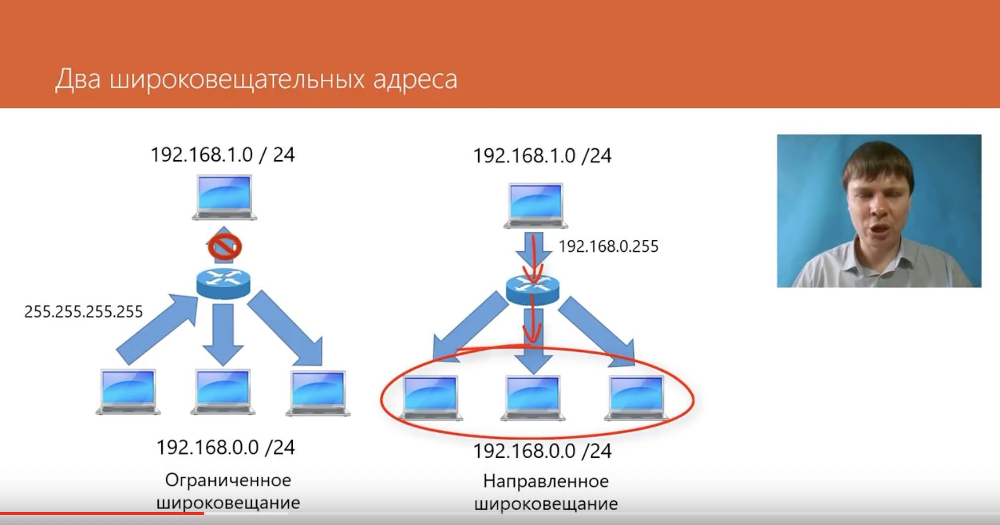
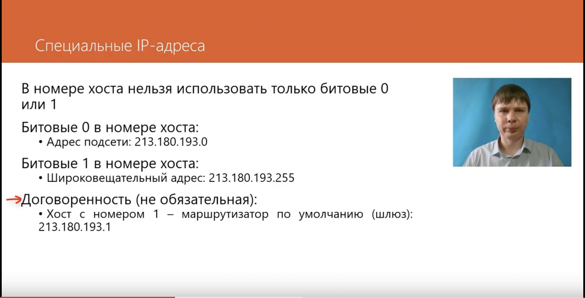
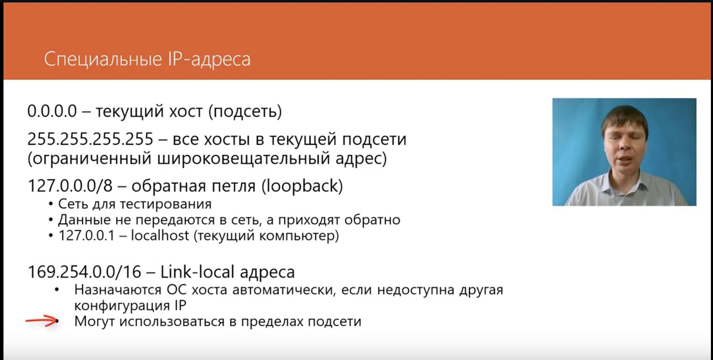
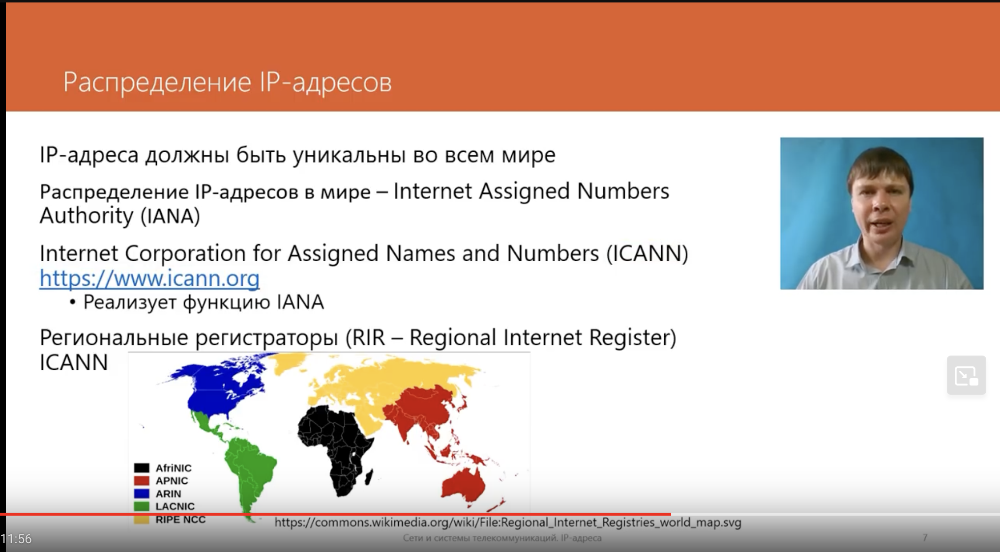

<h1>Network</h1>

<h2 style="color:blue">IP-адрес:</h2>

У каждого устройства есть IP-адрес - идентификатор устройства(узла, хоста) в сети. Этот адрес является глобальным.

Пример: 213.180.193.3

Данный пример представлен в десятичной системе счисления.

Одна часть IP-адреса назывется октет (все части адреса разделены точками)

Длина каждого октета 8 бит, так как адрес изначально представляется в двоичной система счисления, например:
11111111.10101101.10101010.00000011

Значит длина всего IP-адреса - 32 бита или 4 байта.

Здесь идет речь об ipv4 - четвертая версия IP. На сегодняшний день такие адреса уже закончились, поэтому придумали ipv6, которая выглядит длиннее (128 бит вместо 32 бит) и разделителями октетов являеются двоиточия(:), но пока это не надо.

IP делится на адрес подсети(сеть, sub-net) и номер устройства(узла подсети).

В примере выше, допустим, что адрес подсети 213.180, а номер устройства в этой подсети 193.3, но проблема в том что на самом деле мы не знаем.
Чтобы определить адрес подсети в которой распологается устройство необходимо применить маску подсети.

Маска подсети выглядит следующим образом: в маске подсети в октет записывается 255, если это адрес подсети и 0 - если это номер устройства(узла).

Например, если маска подсети для примеры выше будет 255.255.255.0, то это говорит нам о том, что адрес подсети будет 213.180.193.0, а номер устройства будет 0.0.0.3.

Короткий способ записи данной маски: 213.180.193.3/24, то есть адрес сети заполняет 24 бита, а оствальные 8 - номер устройства.

Бывает и не всегда 255, но это уже другая история (пока не надо и не знаю надо ли будет).

<h2>Типы IP-адресов:</h2>

1) Индивидульный адрес (unicast) - это адрес конкретного устройства (предыдущего примера). Если отправить данные на этот адрес, они дойдут до конкретного устройства.

2) Групповой адрес (multicast) - это адрес который используется несколькими компьютерами. Если отправить данные на этот адрес, то они дойдут до всех устройсв(хостов) с данным адресом этой подсети.

3) Широковещательный адрес (broadcast) - это адрес всех устройств в данной подсети. Если отправить данные на этот адрес, то они дойдут до всех устройств(хостов) этой подсети.

Адрес формируется следующим образом: адрес подсети остается неизменным, а адрес хоста полностью заполняется битовыми единицами.
Пример:
IP-адрес  213.180.193.3
Маска: 255.255.255.0
Тогда широковещательный адрес -  213.180.193.255
Широковещательные адреса на сетевом уровне используются только в пределах одной подсети.

Есть два вида широковещательных адресов, ограниченные и направленные.
Ограниченный через маршрутизатор не попадет, а направленный позволяет отправлять данные в другую подсеть.

Для ограниченной подсети можно использовать специальный широковещательный адрес: 255.255.255.255, тогда данные получат все компьютеры этой подсети (см. рисунок).

<h2>Специальные IP-адреса:</h2>

В номере хоста нельзя использовать только битовые 0 или 1.

Если указать только битовые 0, тогда это будет номер подсети.

Если указать только битовые 1, то это будет широковещательный адрес

Часто маршрутизатору по умолчанию в сети или шлюзу через которые все компьютеры попадают в интернет присваивается адрес 1, однако четих правил нет, это просто общая договаренность.

0.0.0.0 - адрес текущего хоста - он испольщуется когда адрес еще не получил свой IP-адрес.

127.0.0.0 - обратная петля (loopback). Это специльный диапазон адресов, который выделен чтобы отлаживать сетевые приложения. Данные не отправляюстя в сеть, а приходят обратно на компьютре.

127.0.0.1 - как правило localhost (твой компьютер). 

169.254.0.0/16 - Link-local адреса. ОС автоматически назначает адрес устройству если не доступны другие конфигурации. Не проходит через маршрутизатор.

IP-адреса должны быть уникальны во всем мире, иначе хост не поймет какому другому хосту отправлять данные. Россия и Европа имеет региональный регистратор RIPE NCC.

<h2>Частный IP-адрес:</h2>

Когда создаем сеть, но нам не нужно чтобы она была подключена к интернету, мы используем дипазоны частных IP-адресов, например, внтуренняя сеть организации. Для такой сети просто банально неудобно просить адреса у регионального регистратора.

Выделенные диапазоны частных IP-адресов определен в документе RFC 1918.

Эти адреса:

10.0.0.0/8

172.16.0.0/12

192.168.0.0/16

Они не маршрутищируются в интернет.

Однако есть возможность подключить сеть построенную на основе частных адресов к интеренет - для этого используется технология трансляции сетевых адресов NAT (Network Address Translation) - она заменяет частные адреса на реальные IP-адреса.

В сети может быть много компьютеров(хостов), однако для подключения к интернет требуется один внешний IP-адрес.